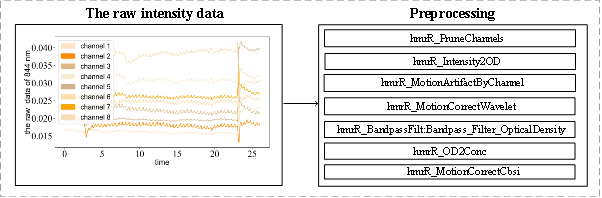

## *1 Data preprocessing*
In order to remove respiration, heart rate, blood pressure fluctuations, Mayer waves noises and others noises. We did preprocessed for the raw intensity data of blood oxygen monitoring device by Homer3, and obtained the preprocessed data of $\Delta HbO$ and $\Delta HbR$. The preprocess contains removing motion artifact operation and filtering operation, and the functions and parameters which were employed are: hmrR_PruneChannels(dRang: 0.01-1, SNRthresh: 2, Sdrange:10.0,45.0), hmrR_Intensity2OD, hmrR_MotionArtifactByChannel(tMtion:0.5, tMask: 1.0, STDEVthresh: 5.0, AMPthresh: 0.05), hmrR_MotionCorrectWavelet(iqr: 1.50, turnon: 1), hmrR_BandpassFilt:Bandpass_Filter_OpticalDensity(hpf: 0.015, lpf:0.085), hmrR _OD2Conc(ppf: 1.0, 1.0) and hmrR_MotionCorrectCbsi (turnon: 1). The preprocess is shown in Fig 1.

Fig 1 The preprocessing process of the raw intensity data of blood oxygen monitoring device by Homer3

## *2 Data content*

The data of one participant in one highly automated driving scenario is stored in a csv file. The data of same participant in same highly automated driving scenario is stored in a subfolder. There are 8 channels. The csv file which contains the raw data $\Delta HbO$ and $\Delta HbR$ and the csv file which contains the preprocessing data of $\Delta HbO$ and $\Delta HbR$  by Homer3 were stored in the folder of “RawfNIRSDataset”, “PreprocessingfNIRSDataset” respectively. The details of their csv files are shown Table 1.

<table>
  <thead>
    <tr>
      <th colspan="4">Raw data CSV</th>
      <th colspan="4">Preprocessing data CSV</th>
    </tr>
    <tr>
      <th>Raw</th>
      <th>Content</th>
      <th>Unit</th>
      <th>Sampling rate</th>
      <th>Row</th>
      <th>Content</th>
      <th>Unit</th>
      <th>Sampling rate</th>
    </tr>
  </thead>
  <tbody>
    <tr>
      <td>1</td>
      <td>The ΔHbO of channel 1</td>
      <td>μmol/L</td>
      <td>100Hz</td>
      <td>1</td>
      <td>The ΔHbO of channel 1</td>
      <td>μM mol/L</td>
      <td>100Hz</td>
    </tr>
    <tr>
      <td>2</td>
      <td>The ΔHbO of channel 1</td>
      <td>μmol/L</td>
      <td>100Hz</td>
      <td>2</td>
      <td>The ΔHbO of channel 1</td>
      <td>μM mol/L</td>
      <td>100Hz</td>
    </tr>
    <tr>
      <td>3</td>
      <td>The ΔHbO of channel 2</td>
      <td>μmol/L</td>
      <td>100Hz</td>
      <td>3</td>
      <td>The ΔHbO of channel 2</td>
      <td>μM mol/L</td>
      <td>100Hz</td>
    </tr>
    <tr>
      <td>4</td>
      <td>The ΔHbO of channel 2</td>
      <td>μmol/L</td>
      <td>100Hz</td>
      <td>4</td>
      <td>The ΔHbO of channel 2</td>
      <td>μM mol/L</td>
      <td>100Hz</td>
    </tr>
    <tr>
      <td>5</td>
      <td>The ΔHbO of channel 3</td>
      <td>μmol/L</td>
      <td>100Hz</td>
      <td>5</td>
      <td>The ΔHbO of channel 3</td>
      <td>μM mol/L</td>
      <td>100Hz</td>
    </tr>
    <tr>
      <td>6</td>
      <td>The ΔHbO of channel 3</td>
      <td>μmol/L</td>
      <td>100Hz</td>
      <td>6</td>
      <td>The ΔHbO of channel 3</td>
      <td>μM mol/L</td>
      <td>100Hz</td>
    </tr>
    <tr>
      <td>7</td>
      <td>The ΔHbO of channel 4</td>
      <td>μmol/L</td>
      <td>100Hz</td>
      <td>7</td>
      <td>The ΔHbO of channel 4</td>
      <td>μM mol/L</td>
      <td>100Hz</td>
    </tr>
    <tr>
      <td>8</td>
      <td>The ΔHbO of channel 4</td>
      <td>μmol/L</td>
      <td>100Hz</td>
      <td>8</td>
      <td>The ΔHbO of channel 4</td>
      <td>μM mol/L</td>
      <td>100Hz</td>
    </tr>
    <tr>
      <td>9</td>
      <td>The ΔHbO of channel 5</td>
      <td>μmol/L</td>
      <td>100Hz</td>
      <td>9</td>
      <td>The ΔHbO of channel 5</td>
      <td>μM mol/L</td>
      <td>100Hz</td>
    </tr>
    <tr>
      <td>10</td>
      <td>The ΔHbO of channel 5</td>
      <td>μmol/L</td>
      <td>100Hz</td>
      <td>10</td>
      <td>The ΔHbO of channel 5</td>
      <td>μM mol/L</td>
      <td>100Hz</td>
    </tr>
    <tr>
      <td>11</td>
      <td>The ΔHbO of channel 6</td>
      <td>μmol/L</td>
      <td>100Hz</td>
      <td>11</td>
      <td>The ΔHbO of channel 6</td>
      <td>μM mol/L</td>
      <td>100Hz</td>
    </tr>
    <tr>
      <td>12</td>
      <td>The ΔHbO of channel 6</td>
      <td>μmol/L</td>
      <td>100Hz</td>
      <td>12</td>
      <td>The ΔHbO of channel 6</td>
      <td>μM mol/L</td>
      <td>100Hz</td>
    </tr>
    <tr>
      <td>13</td>
      <td>The ΔHbO of channel 7</td>
      <td>μmol/L</td>
      <td>100Hz</td>
      <td>13</td>
      <td>The ΔHbO of channel 7</td>
      <td>μM mol/L</td>
      <td>100Hz</td>
    </tr>
    <tr>
      <td>14</td>
      <td>The ΔHbO of channel 7</td>
      <td>μmol/L</td>
      <td>100Hz</td>
      <td>14</td>
      <td>The ΔHbO of channel 7</td>
      <td>μM mol/L</td>
      <td>100Hz</td>
    </tr>
    <tr>
      <td>15</td>
      <td>The ΔHbO of channel 8</td>
      <td>μmol/L</td>
      <td>100Hz</td>
      <td>15</td>
      <td>The ΔHbO of channel 8</td>
      <td>μM mol/L</td>
      <td>100Hz</td>
    </tr>
    <tr>
      <td>16</td>
      <td>The ΔHbO of channel 8</td>
      <td>μmol/L</td>
      <td>100Hz</td>
      <td>16</td>
      <td>The ΔHbO of channel 8</td>
      <td>μM mol/L</td>
      <td>100Hz</td>
    </tr>
  </tbody>
</table>

Table 1 Organization of the content in blood oxygen monitoring device CSV

The information corresponding to the position, velocity and acceleration of ego vehicle and target vehicle (or pedestrian) was contained in a CSV file, and those CSV files were stored in the folder of "VehicleStatusDatase". The CSV file also contains a kinetic energy field and a flag bit, The flag bit indicates the presence of absence of a stimulating sound during the sample time period. If its value is true, then the period contains a stimulating sound. The details of this csv files are shown in Table 2. In this experiment, data is divided into low-risk and high-risk episodes according to one spite point, the data in csv files at front half and later half parts are considered as low-risk data and high-risk data.

| Row  | Content                                                       | Unit   | Sampling rate |
| ---- | ------------------------------------------------------------- | ------ | ------------- |
| 1    | The lateral position of ego vehicle                           | m      | 100Hz         |
| 2    | The longitudinal position of ego vehicle                      | m      | 100Hz         |
| 3    | The lateral velocity of ego vehicle                           | m/s    | 100Hz         |
| 4    | The longitudinal velocity of ego vehicle                      | m/s    | 100Hz         |
| 5    | The lateral acceleration of ego vehicle                       | m/s^2   | 100Hz         |
| 6    | The longitudinal acceleration of ego vehicle                  | m/s^2   | 100Hz         |
| 7    | The lateral position of target vehicle (or pedestrian)        | m      | 100Hz         |
| 8    | The longitudinal position of target vehicle (or pedestrian)   | m      | 100Hz         |
| 9    | The lateral velocity of target vehicle(or pedestrain)         | m/s    | 100Hz         |
| 9    | The longitudinal velocity of target vehicle (or pedestrain)   | m/s    | 100Hz         |
| 11   | The lateral acceleration of target vehicle(or pedestrain)     | m/s^2   | 100Hz         |
| 12   | The longitudinal acceleration of target vehicle(or pedestrain)| m/s^2   | 100Hz         |
| 13   | The kinetic energy field28                                    | kg/s   | 100Hz         |
| 14   | a flag bit                                                    | *      | 100Hz         |

Table 2 Organization of the content in highly automated driving scenario CSV. The * indicates that there is no a unit for the corresponding content.

## *3 Data analysis*

There are four indexes which can be used to explore mental activities based on fNIRS: $\Delta HbO$, $\Delta HbR$, cerebral blood volume exchange $\Delta CBV$ and cerebral oxygen exchange $\Delta COE$. $\Delta COE$ has be used in many studies. Scenarios 04, 05, 07 and 10 belong to four relatively dangerous scenarios for these three typical single-car scenarios. The difference of passengers’ mental activities between low-risk and high-risk segments were compared based on $\Delta COE$. Training and testing data were extracted from those low-risk $\Delta COE$ and high-risk $\Delta COE$ according to a four-second window and a one-second step, and those training and testing data was classified using common there machine learning methods which contains two integration algorithm, Adaboost and composite classifier. The classification results are shown inTable 3. Compared with other algorithms, the testing accuracies of AdaBoost algorithm for scenarios 4, 5, and 7 are the highest. Besides, the data of $\Delta COE$ in low-risk and high-risk segments can be distinguished partly by those three machine learning methods.

<table>
  <tr>
    <th>Scenario</th>
    <th>Accuracy</th>
    <th>Ada Boost</th>
    <th>Composite Classifier</th>
    <th>RandomForest</th>
  </tr>
  <tr>
    <td rowspan="2">Scenario4</td>
    <td>Training accuracy</td>
    <td>100%</td>
    <td>96.79%</td>
    <td>100%</td>
  </tr>
  <tr>
    <td>Testing accuracy</td>
    <td><b>90.54%<b></td>
    <td>76.51%</td>
    <td>87.32%</td>
  </tr>
  <tr>
    <td rowspan="2">Scenario5</td>
    <td>Training accuracy</td>
    <td>100%</td>
    <td>93.90%</td>
    <td>100%</td>
  </tr>
  <tr>
    <td>Testing accuracy</td>
    <td><b>87.34%<b></td>
    <td>69.52%</td>
    <td>83.48%</td>
  </tr>
  <tr>
    <td rowspan="2">Scenario7</td>
    <td>Training accuracy</td>
    <td>100%</td>
    <td>93.66%</td>
    <td>100%</td>
  </tr>
  <tr>
    <td>Testing accuracy</td>
    <td><b>85.54%<b></td>
    <td>69.60%</td>
    <td>81.27%</td>
  </tr>
  <tr>
    <td rowspan="2">Scenario10</td>
    <td>Training accuracy</td>
    <td>100%</td>
    <td>97.05%</td>
    <td>100%</td>
  </tr>
  <tr>
    <td>Testing accuracy</td>
    <td>69.31%</td>
    <td>66.06%</td>
    <td><b>76.22%<b></td>
  </tr>
</table>

Table 3 The classification results of low-risk $\Delta COE$ and high-risk $\Delta COE$ for relatively dangerous scenarios. Composite Classifier is also a integration algorithm, in this paper, it is consists of support vector machine, decision tree, logistic regression and RandomForest, and its result is decided by voting method.